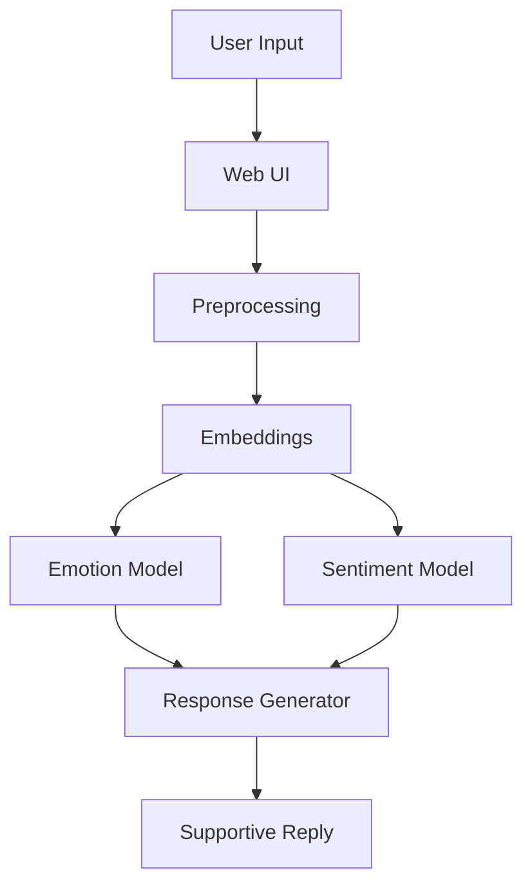

# 🤖 Chatbot for Mental Health Support using NLP

This project aims to build an AI-powered mental health support chatbot that provides empathetic and private emotional support using Natural Language Processing (NLP).  
It can understand user emotions, classify sentiment, and respond with supportive and context-aware messages.

## 🧩 Features
- Emotion & sentiment detection from text  
- Context-aware response generation  
- User-friendly web interface (Streamlit / Flask)  
- Ethical and privacy-conscious AI design  

## 🛠️ Tech Stack
- **Python**
- **NLTK**, **Transformers (Hugging Face)**, **PyTorch/TensorFlow**
- **Flask** or **Streamlit**
- **VS Code**, **GitHub**

## 🧬 Dataset
- Publicly available emotion/sentiment datasets from [Kaggle](https://www.kaggle.com/) and [Hugging Face](https://huggingface.co/datasets).

## 🚀 How to Run

```bash
pip install -r requirements.txt
python app.py
```
## 🧠 Architecture



